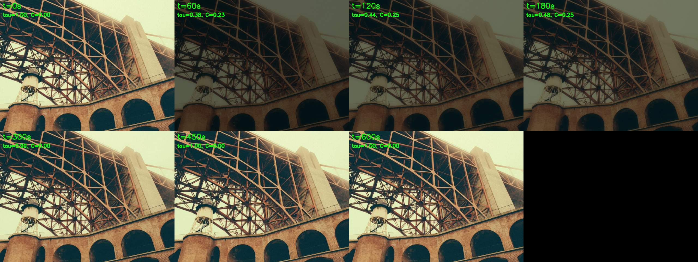
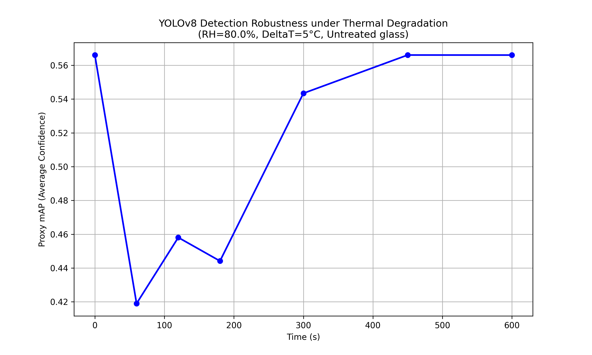

# RAMS 2027 — Physics-Informed Reliability of AV Camera Perception Under Thermal Degradation

**Conference:** RAMS 2027  
**Team:** Sri Lahari Kari, Yashitha, Aditya, Vijay  

---

## 1. Project Overview

This project builds a **physics-informed perception evaluation pipeline** for autonomous vehicle (AV) cameras. The core idea:

1. **Layer 1 (Physics — Yashitha's work):** A MATLAB simulation models what happens when an AV camera lens gets fogged up due to thermal condensation. It calculates two time-varying quantities:
   - **τ(t)** — optical transmittance (how much light passes through the fogged lens, 0 to 1)
   - **σ(t)** — Mie scattering blur width (how blurry the image becomes due to water droplets, in pixels)
   - **C(t)** — condensation coverage fraction (what percentage of the lens is covered by water droplets)

2. **Layer 2 (Perception — our work):** We take those physics outputs and apply them to real camera images, then run a YOLOv8 object detector to measure **how much the detection performance degrades** during fogging, and how it recovers when a heater activates.

The end goal is to produce **reliability metrics** (availability curves, MTTF, blackout duration) that can be used in the RAMS 2027 paper.

---

## 2. Repository Structure

```
RAMS/
├── .gitignore                    # Excludes .venv, __pycache__, .pt, temp files
├── matlab/                       # Layer 1 — Yashitha's physics code
│   ├── RAMS_FinalCode.m          # Main MATLAB simulation (997 lines)
│   ├── tau_lookup_W3.csv         # Exported transmittance data (τ, C vs time)
│   └── kernel_lookup_W3.csv      # Exported Mie scattering data (σ vs time)
├── python/                       # Layer 2 — Our perception pipeline
│   ├── requirements.txt          # Python dependencies
│   ├── lookup.py                 # Physics parameter translator
│   ├── corruptor.py              # Image degradation engine
│   ├── download_sample.py        # Sample image downloader
│   ├── experiment.py             # Main experiment runner (Snapshot Mode)
│   └── visualize_corruption.py   # Corruption visualization grid generator
├── data/                         # Downloaded test images
│   └── sample_images/            # 5 sample images from picsum.photos
├── results/                      # Latest experiment outputs
│   ├── availability_curve.png    # YOLOv8 confidence vs time plot
│   └── corrupted_images/         # Corrupted images at each time step
├── initial_results/              # Archived results for team reference
│   ├── availability_curve.png
│   └── corrupted_images/
├── docs/                         # Project documentation
│   ├── RAMS2027_Abstract_Submission.docx
│   ├── RAMS2027_Kickoff_Plan.docx
│   └── RAMS - YT.docx
└── archive/                      # Legacy Week 1 code (kept for reference)
    └── Rams Week 1 YT/
```

---

## 3. What Each File Does

### `matlab/RAMS_FinalCode.m`
Yashitha's main physics simulation. Contains 16 sections covering:
- Environmental parameters (temperature, humidity, dewpoint)
- Induction lag model (Carey 2008) — how long before condensation starts
- Coverage fraction C(t) — how fast droplets spread across the lens
- Beer-Lambert transmittance τ(t) — how much light is blocked
- Mie scattering kernel σ(t) — how much blur the droplets cause
- Heater recovery model (Tanasawa 1991) — how fast the heater clears the fog
- Reliability metrics (MTTF, availability, mission reliability)
- 8 publication-quality plots
- 14 physics validation assertions

### `matlab/tau_lookup_W3.csv`
A CSV table exported from the MATLAB code. Each row contains `(t_s, DeltaT_C, RH, surface, tau, C, A)` — the transmittance, coverage, and availability at each time step for different environmental conditions and surface treatments. This is the bridge between Layer 1 and Layer 2.

### `matlab/kernel_lookup_W3.csv`
A CSV table with `(t_s, sigma_Mie_px, r_droplet_um, Q_ext)` — the Mie scattering blur width and droplet properties at each time step.

### `python/lookup.py`
**The translator between Layer 1 and Layer 2.** Contains the `PhysicsLookup` class that:
- Loads both CSV files from the `matlab/` folder
- Given a time `t`, environment parameters (ΔT, RH, surface type), returns `(τ, σ, C)` via linear interpolation
- This means our Python code never hardcodes any physics — it reads Yashitha's exact outputs

### `python/corruptor.py`
**The image degradation engine.** Contains the `OpticalCorruptor` class that takes a clean image and applies three physics-informed effects:
1. **Mie scattering blur** — Gaussian blur with `effective_σ = σ × √C`. Applied globally because forward-scattered light from droplets spreads across the entire image plane.
2. **Beer-Lambert attenuation** — Darkens the image by multiplying pixel values by τ (transmittance).
3. **Veiling glare** — Adds a milky haze overlay. When light is scattered by droplets, some becomes a uniform bright "veil" that washes out the image. Intensity = `(1 - τ) × 0.35 × 255`.

When C = 0 (no droplets), all three effects vanish and the image is returned untouched.

### `python/download_sample.py`
A utility script that downloads 5 sample images (800×600) from picsum.photos into `data/sample_images/`. These serve as placeholder test images until we integrate the full BDD100K driving dataset.

### `python/experiment.py`
**The main experiment orchestrator.** Runs the "Snapshot Mode" evaluation:
1. Loads YOLOv8n (nano) pretrained model (~6MB, auto-downloads)
2. Loads 5 sample images
3. Defines time snapshots: `[0, 60, 120, 180, 300, 450, 600]` seconds
4. For each snapshot: corrupts all images → runs YOLOv8 → records average confidence
5. Generates an availability curve plot saved to `results/availability_curve.png`

### `python/visualize_corruption.py`
Generates visual grids showing how each sample image degrades across all 7 time snapshots. Each grid shows the same image at t=0s through t=600s with physics parameters (τ, C) labeled. Saved to `results/corrupted_images/`.

### `python/requirements.txt`
```
pandas, numpy, opencv-python, ultralytics, matplotlib, requests
```

---

## 4. Phases — Completed vs Remaining

### ✅ Phase 1: Environment Setup
- Created the folder structure (`matlab/`, `python/`, `docs/`, `archive/`)
- Initialized Git repo and linked to GitHub
- Created Python virtual environment with all dependencies

### ✅ Phase 2: `lookup.py` — Physics Translation Layer
- Built the `PhysicsLookup` class to read Yashitha's CSV exports
- Interpolates (τ, σ, C) for any arbitrary time and environment

### ✅ Phase 3: `corruptor.py` — Image Corruption Engine
- Built the `OpticalCorruptor` class with three degradation channels
- Iterated through 3 versions:
  - v1: Simple blur + darkening (blur was too strong at recovery)
  - v2: Coverage-weighted blend (blur was barely visible — 77% sharp)
  - v3 (current): Global PSF blur + veiling glare (realistic foggy glass look)

### ✅ Phase 4: Data & Inference Setup
- Created `download_sample.py` to fetch 5 test images
- Set up YOLOv8n with auto-download of pretrained weights

### ✅ Phase 5: Evaluation Loop
- Implemented Snapshot Mode in `experiment.py`
- Runs YOLOv8 across 7 time snapshots and calculates Proxy mAP

### ✅ Phase 6: Visualization
- Created `visualize_corruption.py` for image corruption grids
- Generated availability curve plot (mAP vs time)
- All results pushed to GitHub under `initial_results/`

### ⬜ Phase 7: Full Dataset Scale-up
- Replace the 5 dummy images with a real driving dataset (BDD100K)
- Compute true mAP using ground-truth bounding box annotations
- Run the evaluation on more environmental conditions (vary ΔT, RH, surface)
- May need to move to a cloud GPU (Google Colab) for the full dataset

### ⬜ Phase 8: Paper Integration
- Generate publication-quality plots for the RAMS 2027 paper
- Compute formal reliability metrics: MTTF, availability A(t), mission reliability R(T)
- Compare YOLOv8 results against Yashitha's theoretical τ_th = 0.38 threshold
- Potentially test additional detectors (HybridNets, YOLOP) for comparison

---

## 5. Results

### Corrupted Image Grid (Sample 0)

Shows the same image at 7 time snapshots. Notice: clear at t=0s → foggy/hazy at t=60s → heater recovery by t=300s → fully clear at t=600s.



### Availability Curve

YOLOv8 detection confidence drops ~50% during peak condensation and fully recovers after heater activation.



### Numerical Results

| Time | τ (transmittance) | C (coverage) | Proxy mAP | % Drop from Clean |
|------|-------------------|--------------|-----------|-------------------|
| 0s | 1.00 | 0.00 | **0.566** | 0% (baseline) |
| 60s | 0.38 | 0.23 | **0.281** | −50.3% |
| 120s | 0.44 | 0.25 | **0.305** | −46.1% |
| 180s | 0.48 | 0.25 | **0.327** | −42.2% |
| 300s | 0.99 | 0.00 | **0.562** | −0.7% |
| 450s | 1.00 | 0.00 | **0.562** | −0.7% |
| 600s | 1.00 | 0.00 | **0.566** | 0% (full recovery) |

### Key Findings

1. **Condensation causes a 50% drop in detection confidence** within the first 60 seconds of exposure.
2. **The blackout window lasts roughly 0–240 seconds.** During this time, YOLOv8 struggles to detect objects reliably.
3. **The heater fully restores perception within ~120 seconds** of activation (t_heat = 180s). By t=300s, the lens is essentially clear.
4. **The recovery is fast because** Yashitha's model uses a heater that raises the surface 8.56°C above the dewpoint, giving a recovery time constant of only ~26 seconds (Tanasawa 1991 evaporation model).

> **Note:** These are **proxy mAP values** (average detection confidence), not true mAP. True mAP requires ground-truth annotations, which we'll have in Phase 7 when we integrate BDD100K.

---

## 6. How to Run the Pipeline

```bash
# 1. Activate the virtual environment
cd RAMS
source .venv/bin/activate

# 2. Install dependencies (only needed once)
pip install -r python/requirements.txt

# 3. Download sample images (only needed once)
python3 python/download_sample.py

# 4. Run the experiment (YOLOv8 evaluation across time snapshots)
python3 python/experiment.py

# 5. Generate corruption visualization grids
python3 python/visualize_corruption.py
```

Output files are saved to `results/`. Archived copies are in `initial_results/`.

---

## 7. Git History

```
255c25e9  Improve corruption realism: global PSF blur + veiling glare haze
dcb424eb  Add initial results, fix blur weighting by coverage C(t), add .gitignore
afbec051  Remove temporary file ~$MS2027_Kickoff_Plan.docx
8b018207  Implement experiment and download_sample scripts (Phase 4-6)
4bb927d9  Implement Layer 2 perception stack (lookup and corruptor)
070a26f3  Initial commit: Add Layer 1 physics MATLAB code and documentation
```
