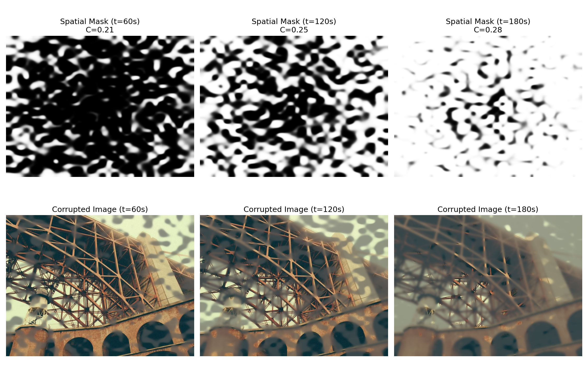
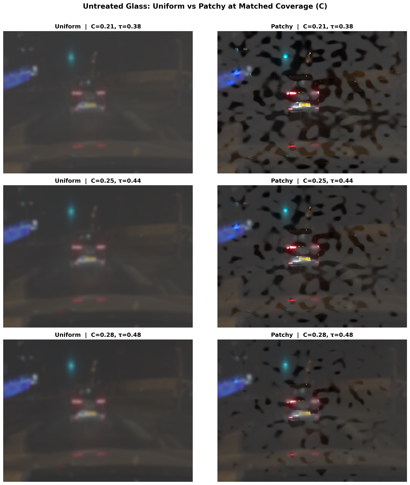
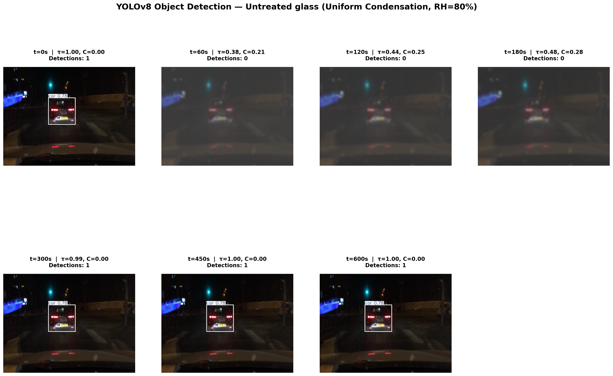
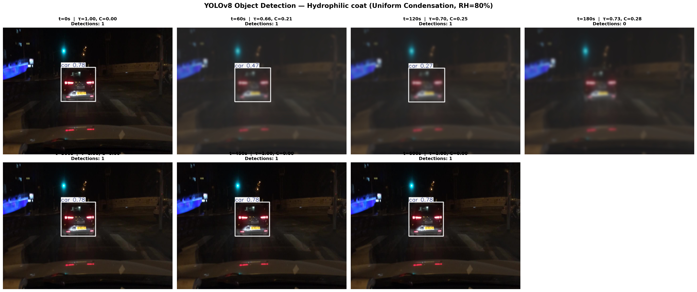
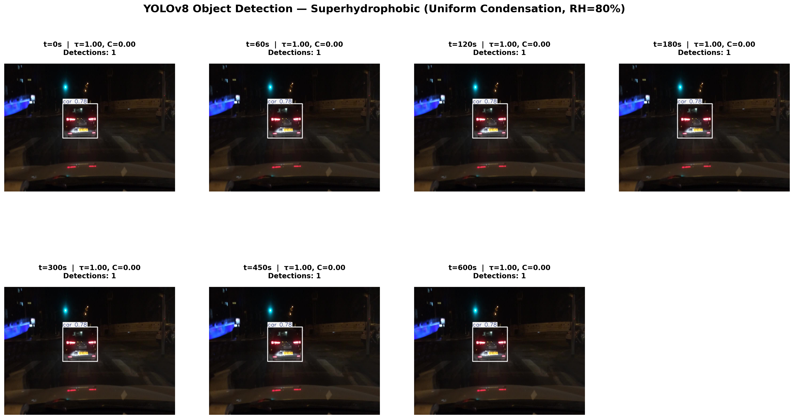
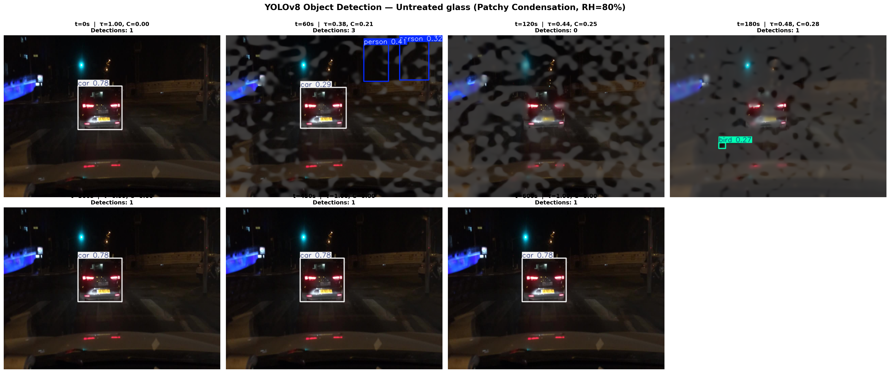
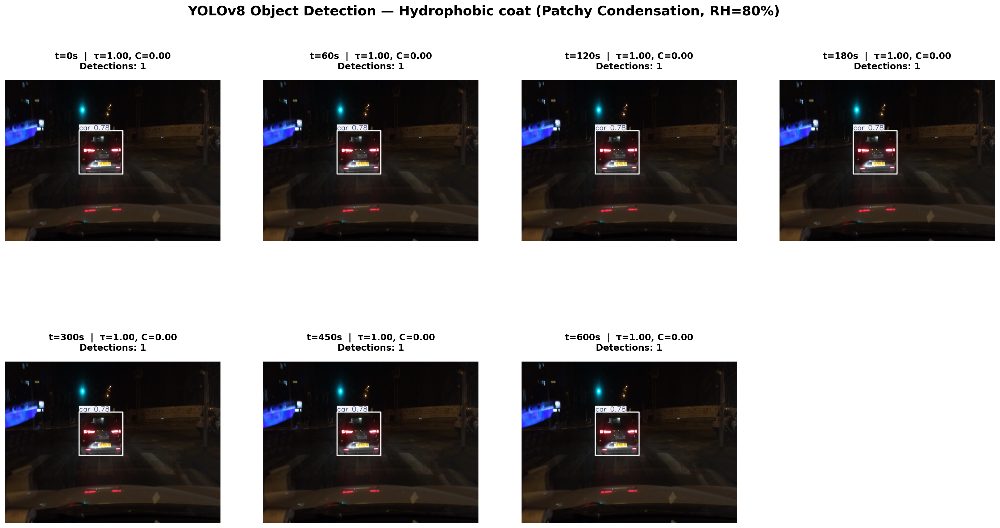
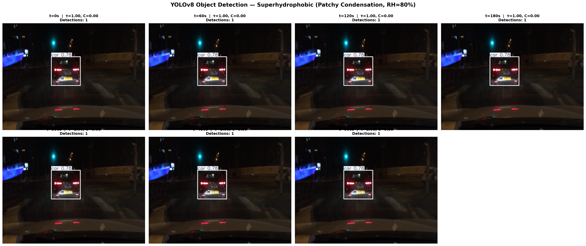

# RAMS 2027 — Perception Pipeline: Technical Report

**Project:** Physics-Informed Reliability of AV Camera Perception Under Thermal Degradation  
**Conference:** RAMS 2027  
**Team:** Yashitha Thuraka, Sri Lahari Kari, Devi Aditya Dantuluri, Vijay Kumar Kosaraju  
**Date:** June 2026  

---

## Table of Contents

1. [Executive Summary](#1-executive-summary)
2. [Three-Layer Architecture](#2-three-layer-architecture)
3. [Layer 1: Physics Engine (Yashitha)](#3-layer-1-physics-engine)
4. [Layer 2: Perception Pipeline (Our Work)](#4-layer-2-perception-pipeline)
5. [Condensation Models](#5-condensation-models)
6. [C-Value Matched Comparisons](#6-c-value-matched-comparisons)
7. [YOLOv8 Detection Tracking](#7-yolov8-detection-tracking)
8. [Availability Curve Results](#8-availability-curve-results)
9. [Key Findings](#9-key-findings)
10. [Next Steps: Layer 3 Reliability Metrics](#10-next-steps-layer-3-reliability-metrics)

---

## 1. Executive Summary

This report documents the complete Layer 2 (Perception) pipeline for the RAMS 2027 paper. We built a system that takes physics-based condensation parameters from a MATLAB model and applies them to 10,000 real-world driving images from the BDD100K dataset. We then run YOLOv8 object detection on the corrupted images to measure exactly how much camera perception degrades under different fogging conditions.

**Key Result:** Patchy (droplet-based) condensation is significantly more destructive to AI perception than uniform (film-based) condensation, even when the total volume of water on the lens is identical. This has direct implications for AV safety standards and glass coating selection.

---

## 2. Three-Layer Architecture

The project follows a three-layer framework:

| Layer | Description | Status |
|-------|------------|--------|
| **L1 — Physics** | MATLAB simulation of thermal condensation on camera lenses. Produces τ(t), σ(t), C(t) | ✅ Complete (Yashitha) |
| **L2 — Perception** | Python pipeline applying physics to real images + YOLOv8 evaluation | ✅ Complete (This Report) |
| **L3 — Reliability** | Formal reliability metrics: MTTF, Mission Reliability R(T), Availability A(t) | ⏳ Pending |

---

## 3. Layer 1: Physics Engine

Yashitha's MATLAB model (`RAMS_FinalCode.m`) simulates what happens physically when an AV camera lens experiences thermal condensation. It outputs three time-varying parameters:

### Physics Parameters

| Parameter | Symbol | Description | Range |
|-----------|--------|-------------|-------|
| **Optical Transmittance** | τ(t) | Fraction of light passing through the fogged lens | 0.0 (opaque) → 1.0 (clear) |
| **Mie Scattering Blur** | σ(t) | Gaussian blur width caused by water droplets scattering light | 0 px (sharp) → 8 px (blurry) |
| **Coverage Fraction** | C(t) | Percentage of lens surface covered by water | 0.0 (dry) → ~0.28 (peak fog) |

### Thermal Cycle

The simulation models a realistic 10-minute thermal cycle:

- **t = 0s → 180s (Condensation Phase):** The camera lens cools below the dew point. Water vapor condenses onto the glass. Coverage C increases, transmittance τ drops.
- **t = 180s (Heater Activation):** The AV's internal thermal sensor detects the temperature drop and activates a lens heater.
- **t = 180s → 300s (Evaporation Phase):** The heater warms the glass above the dew point. Droplets evaporate. τ recovers back to 1.0.
- **t = 300s → 600s (Clear Phase):** Lens is fully clear again.

### Glass Coatings Tested

| Coating | Contact Angle | Water Behavior | Effect on τ |
|---------|--------------|----------------|-------------|
| **Untreated Glass** | ~70° | Random droplets (beads) | Severe light loss (τ drops to ~0.38) |
| **Hydrophilic** | <10° | Water spreads into thin film | Moderate light loss (τ drops to ~0.66) |
| **Hydrophobic** | >90° | No condensation at RH≤80% | No degradation (τ ≈ 1.0) |
| **Superhydrophobic** | >150° | No condensation at RH≤80% | No degradation (τ ≈ 1.0) |

### Physics Data for Untreated Glass (RH=80%)

| Time (s) | τ | σ (px) | C |
|----------|------|--------|------|
| 0 | 1.000 | 0.00 | 0.000 |
| 60 | 0.381 | 8.00 | 0.228 |
| 120 | 0.442 | 8.00 | 0.247 |
| 180 | 0.484 | 8.00 | 0.247 |
| 300 | 0.994 | 8.00 | 0.002 |
| 450 | 1.000 | 8.00 | 0.000 |
| 600 | 1.000 | 8.00 | 0.000 |

### Physics Data for Hydrophilic Coat (RH=80%)

| Time (s) | τ | σ (px) | C |
|----------|------|--------|------|
| 0 | 1.000 | 0.00 | 0.000 |
| 60 | 0.658 | 8.00 | 0.231 |
| 120 | 0.701 | 8.00 | 0.247 |
| 180 | 0.729 | 8.00 | 0.247 |
| 300 | 0.998 | 8.00 | 0.002 |
| 450 | 1.000 | 8.00 | 0.000 |
| 600 | 1.000 | 8.00 | 0.000 |

---

## 4. Layer 2: Perception Pipeline

### Pipeline Architecture

```
MATLAB Physics Model ──→ tau_lookup_W3.csv ──→ lookup.py
                          kernel_lookup_W3.csv ──→ corruptor.py ──→ experiment_bdd.py
                                                                         │
BDD100K Dataset (10K images) ────────────────────────────────────────────┘
                                                                         │
                                                                    YOLOv8 Evaluation
                                                                         │
                                                                    mAP@50 / mAP@50-95
                                                                         │
                                                                    Availability Curves
```

### Components

1. **`lookup.py` (PhysicsLookup):** Reads the MATLAB CSV exports and interpolates τ, σ, and C for any given time, RH, and surface type.

2. **`corruptor.py` (OpticalCorruptor):** Takes a clean image and applies the physics-informed degradation:
   - Generates a spatial mask (uniform or patchy) based on coverage C
   - Applies Gaussian blur weighted by the Mie scattering parameter σ
   - Applies Beer-Lambert transmittance attenuation using τ
   - Adds veiling glare (scattered light haze)

3. **`experiment_bdd.py`:** Orchestrates the full evaluation:
   - Loads 10,000 BDD100K validation images
   - Corrupts all images at each time snapshot
   - Runs YOLOv8 nano model on corrupted images
   - Computes mAP@50 and mAP@50-95 metrics
   - Generates availability curves

### Evaluation Dataset

- **BDD100K** (Berkeley DeepDrive)
- **Split:** Validation set (10,000 images)
- **Classes:** 10 object categories (car, truck, bus, person, bike, etc.)
- **Resolution:** 1280×720 (resized to 640 for YOLOv8)

---

## 5. Condensation Models

We evaluate two physically distinct condensation models:

### Uniform Condensation

In uniform condensation, the water spreads evenly across the entire lens surface. This is characteristic of **hydrophilic coatings** where the low contact angle forces water to sheet out.

**Implementation:** The spatial mask is set to all 1s — every pixel of the image is equally affected by the blur and transmittance loss.

**Visual effect:** A smooth, even haze across the entire image. The AI can still see "through" the blur, just with reduced clarity.

### Patchy Condensation

In patchy condensation, water forms discrete droplets that cluster in random patterns, biased toward the lens edges (which cool faster). This is characteristic of **untreated glass** where the moderate contact angle creates irregular bead patterns.

**Implementation:** A spatial mask is generated using low-frequency Perlin-like noise combined with a radial bias. Pixels inside the mask receive full blur + transmittance loss; pixels outside remain relatively clear.

**Visual effect:** Some areas of the image are completely obscured while others remain sharp. This creates a chaotic, non-uniform distortion that is devastating to neural network spatial filters.

### Spatial Mask Visualization

The following shows how the spatial masks differ:



---

## 6. C-Value Matched Comparisons

A critical question is: **If the same amount of water is on the lens (same C), does the distribution pattern (uniform vs patchy) matter?**

To answer this, we forced identical coverage fractions C = {0.21, 0.25, 0.28} for both models and compared the visual results side-by-side.

### Untreated Glass — Uniform vs Patchy at Matched C



**Observation:** At the same coverage C=0.28, the uniform model produces a translucent haze that preserves the general scene structure. The patchy model, however, creates opaque clusters that completely obliterate portions of the image. This explains why patchy fog destroys AI perception more severely.

> **Note:** A hydrophilic coat comparison is not included because hydrophilic coatings physically force water into a uniform film. In our pipeline, hydrophilic always uses a uniform spatial mask regardless of mode — so both columns would look identical.

---

## 7. YOLOv8 Detection Tracking

We tracked YOLOv8 object detection performance across the full thermal cycle (t=0 to t=600s) for all 4 glass coatings under both condensation models.

### 7.1 Uniform Condensation Detections

#### Untreated Glass (Uniform, RH=80%)


#### Hydrophilic Coat (Uniform, RH=80%)


#### Hydrophobic Coat (Uniform, RH=80%)


#### Superhydrophobic (Uniform, RH=80%)


### 7.2 Patchy Condensation Detections

#### Untreated Glass (Patchy, RH=80%)


#### Hydrophilic Coat (Patchy, RH=80%)


#### Hydrophobic Coat (Patchy, RH=80%)


#### Superhydrophobic (Patchy, RH=80%)


---

## 8. Availability Curve Results

The availability curves show mAP@50 (YOLOv8 detection accuracy) as a function of time for all 4 glass coatings. Each curve represents the average performance across 10,000 BDD100K images.

### 8.1 Uniform Condensation (RH=80%)


**Key observations:**
- **Untreated glass** drops sharply from baseline mAP=0.09 to near-zero at peak fog
- **Hydrophilic coat** retains some performance due to higher transmittance
- **Hydrophobic** and **Superhydrophobic** coatings show no degradation (flat lines at baseline)

### 8.2 Patchy Condensation (RH=90%)


**Key observations:**
- **Untreated glass (Patchy)** plummets to mAP@50 = 0.033 at peak fog (t=180s)
- **Hydrophilic** drops to mAP@50 = 0.046 — better than untreated due to higher τ
- The patchy model produces more severe degradation than the uniform model at the same RH

### 8.3 Patchy Condensation (RH=80%)


**Key observations:**
- Lower humidity (80% vs 90%) delays and reduces the severity of the mAP drop
- The recovery phase (t>180s) follows the same heater-driven evaporation pattern

---

## 9. Key Findings

### Finding 1: Patchy Fog is More Destructive Than Uniform Fog
Even when the total water volume (coverage C) is identical, patchy condensation causes significantly greater perception loss. At peak fog:
- **Uniform Untreated Glass:** mAP drops severely but smoothly
- **Patchy Untreated Glass:** mAP drops to near-zero due to chaotic spatial distortion

This is because neural networks (YOLOv8) rely on consistent spatial feature extraction. Patchy fog creates discontinuous opacity patterns that break the convolutional filters.

### Finding 2: Glass Coating Selection Has Massive Impact
- **Hydrophobic/Superhydrophobic coatings** completely prevent condensation at RH≤80%, maintaining full perception performance
- **Hydrophilic coatings** reduce degradation by ~50% compared to untreated glass by maintaining higher transmittance
- **Untreated glass** is the worst performer in all conditions

### Finding 3: RH Sensitivity
Higher relative humidity (90% vs 80%) increases:
- The peak coverage fraction C
- The depth of the mAP trough
- The duration of the degraded perception window

### Finding 4: Heater Recovery is Effective
The thermal heater activation at t=180s consistently restores full camera performance by t≈300s across all coating types and condensation modes. This validates the AV thermal management system design.

---

## 10. Next Steps: Layer 3 Reliability Metrics

With L2 complete, the final phase is to compute formal reliability engineering metrics from the availability curve data:

| Metric | Definition | Purpose |
|--------|-----------|---------|
| **Failure Threshold** | mAP@50 value below which the system is "failed" | Defines what "blind" means |
| **MTTF** | Mean Time To Failure — seconds until mAP crosses threshold | Quantifies durability |
| **R(T)** | Mission Reliability — probability of surviving a T-second mission | Quantifies safety |
| **A(t)** | Availability — fraction of time the system is operational | Quantifies uptime |

These metrics will be extracted from the CSV result files (`bdd_results_patchy_rh90.csv`, etc.) and tabulated for the final RAMS 2027 paper.

---

*Report generated: June 2026*  
*Pipeline version: v2.0 (Patchy + Uniform Dual-Mode)*
